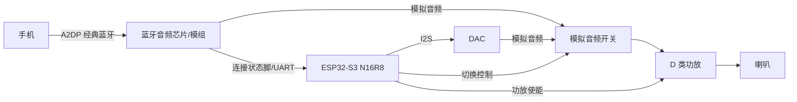

# ESP32-S3 E-Ink 硬件设计简报

## 项目目标

设计一块以 ESP32-S3 为主控、驱动电子墨水屏（e-ink / e-paper）的硬件主板。

## 当前状态（2026-09-10）

- 工程文件：`ProPrj_esp32-s3-eink-hardware_2026-09-10.epro2`（EasyEDA Pro 3.2.175）。
- 原理图页 `P1`：仅 A4 图框与标题栏，无任何元件、网络。
- PCB `PCB1`：仅默认层栈与设计规则，无板框、无封装、无走线。
- 结论：全新空白工程，电路设计尚未开始；本简报为选型与绘制前的规划。

## 关键未决决策（阻塞原理图绘制）

显示方案按**通用接口**设计（屏可更换）：PCB 绑定标准模块接口与 GPIO9–14 引脚，不绑定具体屏型号；当前 2.13" 三色屏为固件实测参考。剩余决策：

| 决策项 | 选项 | 影响 |
| --- | --- | --- |
| 屏幕形态 | 带驱动板模块 vs 裸屏 | 模块只需 3.3V + 6 信号；裸屏需按屏厂参考设计加高压驱动电源 |
| 接口形式 | 排针 / FPC / 板对板 | 影响板框与 BOM |
| 供电方式 | 仅 USB-C；USB-C + 锂电池 | 充电 IC、电量计、电源路径 |
| ~~模组容量~~ | **已定：N16R8**（2026-09-10 用户确认） | 16MB Flash + 8MB 八线 PSRAM，满足图片/JPEG 解码与后续换大屏 |
| 下载方式 | UART / 原生 USB / 两者 | 是否保留 GPIO43/44 排针与 GPIO19/20 USB |

## 墨水屏接口（通用设计，屏可更换）

**设计原则（2026-09-10 用户确认）：不绑定具体屏型号/尺寸。** 后续可能更换不同型号与大小的墨水屏，但它们共用同一套硬件接口。因此 PCB 按「标准带驱动板墨水屏模块接口」设计，当前 2.13" 屏仅作为固件实测参考；换屏只改固件几何与波形参数，硬件不动。

接口契约（各类带驱动板墨水屏模块通用）：

| 引脚 | 信号 | 说明 |
| --- | --- | --- |
| 1 | VCC | 3.3V 供电 |
| 2 | GND | 地 |
| 3 | DIN | SPI MOSI（GPIO11） |
| 4 | CLK | SPI 时钟（GPIO12） |
| 5 | CS | 片选（GPIO10） |
| 6 | DC | 数据/命令（GPIO9） |
| 7 | RST | 复位（GPIO14） |
| 8 | BUSY | 忙状态（GPIO13） |

注：最终连接器脚位顺序以所选模块实物为准，PCB 投板前必须核对；上表为通用参考。

### 电源设计（按可换大屏留余量）

- 三色屏完整刷新峰值电流随尺寸增大（2.13" 实测约 21 s 完整刷新）；3.3V 轨按目标上限尺寸的刷新峰值 + 50% 余量设计。
- 屏接口附近预留去耦/储能电容位置；VCC/GND/BUSY/RST/CS/DC 预留测试点。

### 实测参考屏（YMS122250，仅固件参考，非 PCB 绑定项）

### 规格

- 名称：2.13 寸墨水屏，型号 `YMS122250-0213BAAMFGN`
- 分辨率：250 × 122（应用层横屏使用；控制器原生方向 122 × 250）
- 颜色：黑白红三色
- 控制器：SSD1680 兼容命令集
- 刷新：仅完整刷新，**不支持**快刷/局部刷新；完整刷新实测约 21 s，期间黑白红反复闪烁属正常
- 固件已解决边缘杂色线（border waveform 0x05）与显示方向问题

### ESP32-S3 引脚分配（第一版 PCB 必须保留）

| GPIO | 信号 | 方向 | 说明 |
| --- | --- | --- | --- |
| GPIO9 | D/C | S3 → 屏 | 低=命令，高=数据 |
| GPIO10 | CS | S3 → 屏 | SPI 片选，低有效，仅一根 CS（无 CS2） |
| GPIO11 | DIN/MOSI | S3 → 屏 | SPI 数据输出 |
| GPIO12 | CLK/SCLK | S3 → 屏 | SPI 时钟输出 |
| GPIO13 | BUSY | 屏 → S3 | 高=忙碌，低=空闲；屏主动驱动，无上/下拉 |
| GPIO14 | RST | S3 → 屏 | 低有效；脉冲 20 ms 低 + 释放等 20 ms |

不使用 MISO（只写设备）；BUSY 轮询（10 ms 周期，30 s 超时）。

### SPI 总线参数

- SPI2_HOST，Mode 0，4 MHz（保守实测稳定），硬件 CS，DMA（`SPI_DMA_CH_AUTO`），单次最大传输 4000 字节。

### 帧缓存与颜色映射

- 每颜色平面：122/8 = 16 字节/行 × 250 行 = 4000 字节
- 黑白平面 4000 B + 红色平面 4000 B = 总帧缓存 8000 B
- 颜色映射：白 = BW:1/R:1；黑 = BW:0/R:1；红 = BW:1/R:0

### 已验证控制器配置（勿随意改动）

| 寄存器 | 值 |
| --- | --- |
| Booster soft start (0x0C) | 8B 9C 96 0F |
| Driver output control (0x01) | 249, 0x00（250 栅线） |
| Data entry mode (0x11) | 0x03 |
| RAM X window (0x44) | 0x00 ~ 0x0F |
| RAM Y window (0x45) | 0x0000 ~ 0x00F9 |
| Border waveform (0x3C) | 0x05（解决边缘杂色） |
| Temperature sensor (0x18) | 0x80（内部传感器） |
| Display update control 1 (0x21) | 0x80, 0x80 |
| Display update control 2 (0x22) | 0xF7（完整刷新） |

### PCB 设计注意事项（来自固件交接）

1. 第一版完全保留上述 GPIO 分配，不为布线换脚；若必须换脚需同步改固件引脚宏。
2. 墨水屏信号为 3.3V 逻辑，当前开发板按 3.3V 测试通过。
3. 必须确认实际购买的是带驱动板模块还是裸屏；裸屏不能只接 3.3V，需按屏厂参考设计加驱动电源。
4. 必须拿到 YMS122250 实际连接器引脚图，禁止按信号名推测脚位顺序。
5. 电源按完整刷新升压峰值电流设计，不能只按静态电流。
6. 3.3V 入口与屏接口附近预留去耦/储能电容位置。
7. 3.3V、GND、BUSY、RST、CS、DC 预留测试点。
8. 4 MHz SPI 无需严格阻抗控制，但走线要短、保证完整地平面回流。
9. 后续其他 SPI 设备可共享 SPI2（独立 CS，验证时序）。
10. 刷新期间 BUSY 高电平持续约 21 s，不要接到影响启动的电平检测电路。
11. ESP32-S3 模组天线区按规格书留净空，避免被屏排线/金属件/大面积铜箔遮挡。
12. UART 控制台当前用 GPIO43/44；原生 USB 需保留 GPIO19/20（D-/D+）。
13. **模组 EPAD 热焊盘（2026-09-11 补充，官方数据手册核实）**：ESP32-S3-WROOM-1 底部有中央热焊盘，官方符号中编为**第 41 脚 EPAD**（1=GND、40=GND）。官方原文：「Soldering the EPAD to the ground of the base board is not a must, however, it can optimize thermal performance.」——**可焊可不焊**，焊了散热更好；但锡膏不能放多，过多会抬高模组导致其他引脚焊接不良。**选封装时必须确认它带这个中央焊盘，并与 GND 同网络**——元件库常把它当机械焊盘而不建脚位，漏了就完全没有散热路径。
14. EPAD 接地做法（官方 Hardware Design Guidelines）：中央热焊盘下方布置 **≥9 个（推荐 16 个）0.5 mm 地过孔**；建议在 EPAD 上做**方格分格**、缝隙覆盖锡膏、过孔打在缝隙里，可有效避免回流焊时漏锡导致模组位移。热焊盘必须与地铜皮充分接触，**不能用细走线连**。
15. **U1 封装来源与实测尺寸（2026-09-11 已验证）**：
    - 立创商城器件 **C2913202**（`ESP32-S3-WROOM-1-N16R8`，商品页 item.szlcsc.com/3198300.html），封装名 `WIRELM-SMD_ESP32-S3-WROOM-1`。**实测其封装数据，与官方一致，可放心使用**：
      - 40 个边缘焊盘 **1.5 × 0.9 mm，间距 1.27 mm**（左侧 14 + 底部 12 + 右侧 14）
      - **第 41 脚 EPAD：9 个 0.9 × 0.9 mm 焊盘，3×3 阵列，间距 1.4 mm，整体 3.7 × 3.7 mm**
      - **封装内不含热过孔** —— 地过孔阵列必须在 PCB 里自己打。
    - 官方权威来源：Espressif 官方 KiCad 库 `github.com/espressif/kicad-libraries`（`symbols/` + `footprints/Espressif.pretty/` + `3dmodels/espressif.3dshapes/`），其 `ESP32-S3-WROOM-1.kicad_mod` 实测与立创封装尺寸完全吻合；仓库自述「所有封装均按各模组数据手册的 Recommended PCB Land Pattern 章节设计」。
    - **注意**：数据手册内嵌的 land pattern 源文件链接（`espressif.com/sites/default/files/modules-dxf/...`）**已 403 失效**，别照手册里的老链接找；要从模组产品页或 KiCad 库取。

## 共用平台（各方案通用）

- **主控（已定稿）**：ESP32-S3-WROOM-1-N16R8 模组（3.3V 供电；16MB Flash + 8MB 八线 PSRAM）。
- 模组化设计带来的简化：无需外部晶振、Flash、PSRAM、RF 匹配电路；只需 3.3V 供电 + EN 复位 + GPIO0 启动电路；按模组规格书留天线净空。
- **双 USB-C（已确认）**：Type-C 1 = COM 口（GPIO43/44 经 USB-UART 桥接芯片，下载/日志）；Type-C 2 = USB 口（GPIO19/20 原生 USB，下载/供电）。两口均需 CC1/CC2 各 5.1kΩ 下拉 + ESD 保护（如 USBLC6-2SC6）；两路 5V 输入需电源路径防倒灌（理想二极管/PMOS）。
- **3.3V 电源**：DC-DC buck（≥1A，建议按 1.5–2A 预算），覆盖 WiFi 发射峰值与屏幕刷新瞬态。
- **启动/复位**：EN 引脚 RC 复位电路 + 复位按键；GPIO0 BOOT 按键；注意 GPIO45/GPIO46 等 strapping 引脚上/下拉。
- **调试**：UART 排针（TXD0=GPIO43，RXD0=GPIO44）；也可用原生 USB（GPIO19=DM，GPIO20=DP）烧录。
- **状态指示**：WS2812 RGB LED（常用 GPIO48）；至少一个用户按键。
- **SD 卡（已确认）**：microSD 卡座，共享 SPI2（CLK=GPIO12、MOSI=GPIO11、MISO=GPIO21、CS=GPIO8），存人物角色图片库；3.3V 供电，CS/MISO 上拉。
- **扩展预留**：I2C（QWIIC 连接器）、屏 FPC 连接器。

## 方案对比

### 方案 A：COG 屏直驱（小中尺寸，最简单）

- 适用：1.54"–7.5" 常见 COG 电子纸屏（SSD1680 / UC8253 等驱动 IC 内置于屏 FPC）。
- 接口：SPI（SCK/MOSI/MISO/CS）+ BUSY + RES# + PWR#（深度睡眠控制）；FPC 常见 24-pin、0.5mm 间距。
- 电源：SSD16xx 系列内置电荷泵（外接泵电容即可），整板单 3.3V 供电。
- 优点：元件最少、无高压轨设计、成本最低、固件库成熟（GxEPD2 等）。
- 缺点：刷新速度一般；不适用于大尺寸高分屏。

### 方案 B：IT8951（大屏，成熟方案）

- 适用：6" / 10.3" / 12" / 13.3" 等 IT8951 类大屏（如 ED078KC1、ED103UT2、ED133UT2）。
- 结构：IT8951 专用屏驱动芯片 + 屏 FPC；ESP32-S3 经 SPI（或 I80 并口）与 IT8951 通信。
- 电源：需要 VGH/VGL/VCOM 高压生成（板载升压电路），PCB 需注意高压走线隔离与爬电。
- 优点：成熟（Waveshare 同款思路）、支持较大分辨率、驱动负担在专用芯片。
- 缺点：BOM 较多、成本高、双芯片布局布线更复杂。

### 方案 C：EPDiy 裸屏直驱（成本/性能导向，难度最高）

- 适用：无 COG 驱动或追求刷新速度的裸屏。
- 结构：ESP32-S3 直接驱动屏的 source/gate 线，外部生成 ±15–22V（VGH/VGL）与 VCOM 等多路电源轨。
- 优点：单芯片方案、刷新速度最快、长期成本最低。
- 缺点：高压电源、运放、大量分立元件；PCB 与固件难度显著更高，首次设计不推荐。

## 蓝牙音箱功能（2026-09-10 架构已确认：S3 + 专用 BT 音频芯片）

**关键限制**：ESP32-S3 的蓝牙是 **BLE-only**（无经典蓝牙 BR/EDR），**不支持 A2DP**，因此 S3 自己无法当传统蓝牙音箱。必须外加专用蓝牙音频芯片。

### 架构

- 蓝牙音频芯片（杰理/中科蓝讯/BK 类，待选型）：A2DP sink，输出模拟音频，带连接状态输出。
- ESP32-S3 监测连接状态（状态脚中断或 UART）；连接/断开事件触发语音播报。
- 语音播报：MP3/WAV 存 Flash/SD（已有 SD），PSRAM 解码，I2S → DAC → 音频开关 → 功放。
- 播报时 ESP32-S3 切换音频路径并暂停/静音 BT 音频，播完切回。

### 引脚分配（已锁定）

| GPIO | 功能 | 说明 |
| --- | --- | --- |
| 47 | I2S BCLK | 语音播报位时钟 |
| 48 | I2S LRCK | 帧时钟 |
| 38 | I2S DATA | 数据输出 |
| 39 | 音频路径切换 | 选 BT / ESP32 音源 |
| 40 | BT 连接状态 | 输入，中断检测 |
| 41 | 功放使能 | 低功耗控制 |
| 42 | BT UART TX（可选） | 芯片控制，视选型 |

### 电源影响

- D 类功放 3W/4Ω 峰值电流可达 ~1.5–2A；BT 芯片 ~30–50mA。
- 蓝牙音箱 + 播报场景下锂电池的合理性大幅上升，需重新评估整板电源树。

### 音质档次（2026-09-10 用户确认）

**有一定要求，不要「听个响」**（中上档）。对设计的影响：

- 蓝牙芯片：须支持 **AAC**（明显优于 SBC），优先选带 **I2S 输出**的型号，让音乐链路全程数字（BT 解码 → I2S → 功放内置 DAC），避开模拟劣化。
- 功放：选 **I2S 数字输入 D 类**（MAX98357A 类，内置 DAC ~92dB SNR），而非最便宜的模拟输入款。
- 喇叭：全频单元品质是音质第一决定因素，优先 8Ω、3W 起、口径 ≥40mm。
- PCB：音频区独立地、星型接地、功放电源加强退耦。

### 喇叭（2026-09-10 用户确认）

**已定：50mm / 8Ω / 3W 全频单元（B 档）**；板子尺寸无特殊要求（用户确认），为喇叭预留 ≥50×50mm 安装位与 ≥15mm 腔体深度。

### 电池与电量计（2026-09-10 用户确认）

**已定：上锂电池 + 电量计**。

- 电芯：1S 锂聚合物软包 2000–2500mAh；连续放歌约 4–6 h，纯摆件显示模式数周。
- 充电：复用 Type-C 5V + 充电 IC（带保护/状态 LED）。
- 供电架构：电池 → **buck-boost** → 3.3V 系统轨（锂电 3.0–4.2V 会跌破 3.3V）。
- 功放供电：直接取电池电压（经磁珠隔离），功率余量更大且避免音频噪声串入数字轨。
- 电量计：MAX17048（I2C），电量百分比显示在墨水屏上；I2C 引脚 SDA=GPIO1、SCL=GPIO2（4.7kΩ 上拉）。

### 交互与传感（2026-09-10 用户确认）

- **旋转编码器（带按压）**：GPIO4=A、GPIO5=B、GPIO6=SW；转=音量（经 UART 到 BT 模块，AVRCP 同步到电脑/手机），按=播放/暂停/翻页/模式。
- **用户按键 ×2**：GPIO7=BTN1、GPIO16=BTN2；功能待定，内部上拉、按下接地，固件消抖。
- **SHT30 温湿度传感器**：复用 I2C（GPIO1/2），墨水屏显示室内温湿度，零额外引脚。
- **PIR 人体感应：暂缓**（用户决定先不加），未占引脚；后续如需可评估 strapping 脚。

### 充电指示设计（2026-09-10 确认）

**双层设计：硬件 LED 常显 + 软件状态上屏。**

1. **硬件指示（0 GPIO，深睡也可见）**：TP4056 的 CHRG（充电中，开漏低）与 STDBY（充满，开漏低）各驱动一颗 LED。
   - 推荐**红/绿双色共阳 LED**：阳极接 3.3V，红光阴极经 1kΩ 接 CHRG（充电中亮红），绿光阴极经 1kΩ 接 STDBY（充满亮绿）。共阳极不接 5V，避免状态脚被拉到 3.3V 时 LED 两端仍有约 1.7V 压差导致红色灯微亮。
   - 未插电/异常时两灯全灭。
2. **软件检测（1 GPIO）**：CHRG 经 10kΩ 上拉接 **GPIO17**（开漏低=充电中）。固件读电平后在墨水屏显示「充电中/已充满」+ 电量百分比（MAX17048）。
   - GPIO17 在 RTC 域，**支持深睡唤醒**：插充电器瞬间 CHRG 拉低产生下降沿，可唤醒 S3 刷新墨水屏显示充电状态——即使设备正在深睡。
3. **充满判断**：不单独用 STDBY 占 GPIO；由「CHRG=高 + MAX17048 SoC ≥ 98%」推断，省一颗引脚。

资源影响：GPIO17 被占用后，干净空闲仅剩 **GPIO18** 一根。

### 蓝牙音频芯片选型（2026-09-10 调研）

**选定：杰理 AC6956 系列**（立创有货，A2DP sink + SBC/AAC 已核实）。

调研结果：

- AC6956C8：立创 C6930510，QFN-32，¥2.82，库存 1153+，页面对「支持 SBC、AAC 蓝牙音频编解码器」「蓝牙音频处理功能」已核实。
- AC6956C4：立创 C5339900，QFN-32(4x4)，¥2.50，库存 194+，同规格。

落地路线（**2026-09-10 用户已选 A：现成模块**）：

| 路线 | 做法 | 优点 | 代价 |
| --- | --- | --- | --- |
| **A：模块（已选）** | 现成 AC6956 模块（KT1025A 类，¥5–8） | 出厂固件免开发、天线免设计、自带 UART 控制 + 模拟输出 + 状态脚 | 占板面积稍大；需手焊模块 |
| B：裸片 | AC6956C8 裸片 + 杰理 SDK 定制固件 + PCB 天线 | ¥2.8 最便宜、可 JLC 贴装 | 需接入杰理 SDK 写固件（新工具链/新体系）+ RF 布板 |

**音频链路相应修正**（模块模拟输出路线）：BT 模块模拟音频 → 模拟开关（TS5A23157 类）← S3 的 PCM5102 DAC → NS4162 类模拟输入 D 类功放 → 50mm 8Ω 3W 喇叭。AC6956 内置 DAC ~90dB SNR，配合好功放与 50mm 喇叭满足「中上」音质；喇叭仍是音质第一瓶颈。全数字 I2S 路线留作后续升级（需杰理定制固件）。

**与 S3 的接口**：UART（关模块自带提示音、查询连接状态）+ 状态脚中断；播报由 S3 走 PCM5102 → 模拟开关完成。

**音量控制（AVRCP）**：AC6956 模块支持 AVRCP 绝对音量——电脑/手机的系统音量、键盘音量键与板载编码器三向同步，任一端调节都生效。S3 语音播报音量由固件独立控制（保证播报始终可闻）。

### 蓝牙部分状态：已全部定稿。

## EN 复位与 3V3 去耦（2026-09-11 依据官方手册定稿）

### EN（模组第 3 脚）

官方原话（WROOM-1 数据手册 Peripheral Schematics 注释）：建议在 EN 上加 RC 延迟，**推荐 R = 10 kΩ、C = 1 µF**，并按模组上电时序与芯片复位时序微调。

- EN → 10 kΩ → 3V3（上拉）
- EN → 1 µF → GND（RC 延迟，τ = 10 ms）
- EN → 复位按键 → GND
- 作用：让 EN 在 3V3 稳定后才缓慢升到高电平，避免上电瞬间电源未稳就释放复位
- GPIO0（BOOT）同理：10 kΩ 上拉 + 按键到 GND
- GPIO45/46 为 strapping，模组内部已处理，板上不要另加强上/下拉
- 可选进阶：TPS63020 的 PG（Power Good，开漏）脚可用来拉住 EN，实现「电源真正稳定后才放开复位」，比纯 RC 可靠；但需与手动复位按键做逻辑或，第一版用纯 RC 即可

### 3V3（模组第 2 脚）

模组只有 1 根 3V3；GND 为第 1、40 脚 + 第 41 脚 EPAD。

- 3V3 入口：**22 µF bulk + 0.1 µF 高频**，紧贴模组 3V3 引脚（官方模组典型应用图取值；硬件设计指南对芯片的底线是 10 µF + 0.1/1 µF，取 22 µF 更稳）
- 去耦电容的 GND 就近打过孔到地平面，不要长走线拉远
- 电源主干走线 ≥ 25 mil（0.63 mm），VDD3P3 支路 ≥ 20 mil
- 星型分配给 SD、墨水屏接口、I2C、音频小信号，不走菊花链

### TPS63020 外围取值（TI 数据手册 8.2.2）

| 器件 | 取值 | 封装建议 | 备注 |
| --- | --- | --- | --- |
| L1 | **1.5 µH**，Isat ≥ 5 A | 屏蔽式 4×4 或 5×5 mm | TI 推荐 Coilcraft XFL4020-152ME（4×4×2.1，5.1 A，15 mΩ）或 muRata FDV0530S-H-1R5M（5×5×3，5.4 A，24 mΩ）；Isat 需在计算峰值电流基础上 +20% |
| 输入电容 ×2 | 10 µF | 0805，16 V，X7R | 紧贴 VIN/PGND |
| 输出电容 ×3 | 22 µF | 0805 / 1206，10 V，X5R/X7R | 紧贴 VOUT/PGND |
| VINA 旁路 | 0.1 µF | 0402 / 0603，X7R | **不得超过 0.22 µF**（手册硬性限制） |
| FB 分压（3.3 V） | R1 = 1 MΩ / R2 = 180 kΩ | 0402 / 0603 | 也可改用同封装的 **TPS63021（固定 3.3 V 版）**省掉分压 |

### TPS63021 外围接法（2026-09-11 依 TI 手册引脚表定稿，建议改用此型号）

DSJ 14 脚 VSON（3×4 mm）带 PowerPAD。**与 TPS63020 的唯一差别：FB（第 3 脚）直接接 VOUT**，省掉 1 MΩ/180 kΩ 分压。

| 引脚 | 脚号 | 接法 |
| --- | --- | --- |
| VIN | 10, 11 | VBAT，入口 2 × 10 µF（16 V X7R）紧贴 |
| L1 / L2 | 8,9 / 6,7 | 之间接 **1.5 µH** 功率电感（Isat ≥ 5 A，屏蔽式） |
| VOUT | 4, 5 | 3V3，出口 3 × 22 µF（10 V X5R/X7R）紧贴 |
| **FB** | 3 | **直接接 VOUT**（固定版专用接法） |
| VINA | 1 | 接 VIN，对地 0.1 µF（**硬性限制不得超过 0.22 µF**） |
| EN | 12 | 接 VBAT（常开）。**不可悬空** |
| PS/SYNC | 13 | 接 GND（使能省电模式，电池优先）。**不可悬空** |
| GND | 2 | 逻辑地，与 PGND 在 IC 处单点汇合 |
| PG | 14 | 开漏输出，可悬空；可选 100 kΩ 上拉到 3V3，用于「电源好再放开 ESP32 复位」 |
| PowerPAD | — | **必须接 PGND 且必须焊接**（散热+电气），下方打地过孔阵列 |

- PG 的进阶用法：PG 是开漏，可直接拉住 ESP32 的 EN——输出不在稳态时把模组按在复位，稳了再放开，比纯 RC 更可靠，且不影响手动 RST 按键。
- PS/SYNC 取舍：接 GND = 省电模式（轻载效率高，适合电池）；接高 = 强制 PWM（纹波更低，但空载输入电流 ~6 mA）。本板先接 GND，若播报时听到 DAC 底噪，再在 PCM5102A 的 3V3 上加磁珠或改强制 PWM。
- Layout：输入电容贴 VIN/PGND、输出电容贴 VOUT/PGND、电感贴 L1/L2，功率环路面积最小；PowerPAD 下方打地过孔；电感下方及周边不走敏感信号，远离天线区与音频区。
- **PGND 与 GND 的关系（TI 手册原文）**：二者电气上是**同一个网络**（都是 0 V），分开只是为了避开开关电流。手册 7.1 节：「To avoid ground shift problems due to the high currents in the switches, two separate ground pins GND and PGND are used. The reference for all control functions is the GND pin. The power switches are connected to PGND. **Both grounds must be connected on the PCB at only one point, ideally close to the GND pin.**」10.1 节补充：「use wide and short traces for the main current path and for the power ground tracks… separation from the power ground traces. This avoids ground shift problems, which can occur due to superimposition of power ground current and control ground current.」要点：
  - PGND 走 4 A 级、2.4 MHz 的脉冲电流，di/dt 极高；GND 是内部基准与 FB 比较器的参考，要求干净。
  - 共用导体时，ΔV = L·di/dt 会直接叠加到控制参考上 → 基准抖动、稳压精度下降、环路不稳。
  - **正确理解是「分区 + 单点汇合」，不是「分割地平面」**；不要把地平面切成两块再用细线/磁珠相连。
  - 本板 4 层优先，第 2 层做完整地平面；DC-DC 功率环路局部收紧，音频区仍按既定方案做星型接地。

### 全域地网络决策（2026-09-11 定稿）

**结论：原理图全板只用一个 `GND` 网络，不新建 `PGND` 网络标号。** 分区与单点汇合全部在 PCB 布局层实现。

理由：

1. TPS63021 的 PGND **就是 PowerPAD（热焊盘）**，没有独立 PGND 引脚。若强行分网络，需给热焊盘单独分配网络，再加 0Ω 电阻或 net-tie 焊盘把它接回 GND —— 多一个器件、多一处电阻，且无收益。
2. **决定噪声的是 PCB 布局，不是网络名。** 4 层板 + 第 2 层完整地平面 + 功率环路收紧在 IC 周围时，开关回流的镜像电流会自动贴着环路走，不会扩散到全板。
3. 分了网络却布局没做对会更糟：DRC 报未连接，或随手用一根长细线连通 —— 那根线就是新的共阻抗路径，比不分还差。
4. 音频区的「星型接地」本质是同一套思路（让大电流回流与小信号回流分区、在电源入口一点汇合），同样属于**布局分区分流，不靠原理图分网络**。

PCB 阶段需要落地的动作（这才是「单点汇合」的实现）：

- 输入电容 C4/C5、输出电容 C6–C8、电感 L1 **全部紧贴 IC**（最有效的一招）。
- PowerPAD 下方做地铜皮 + 3×3 过孔阵列，直连第 2 层地平面；GND 脚（第 2 脚）的过孔紧挨着 PowerPAD 的过孔。
- VINA 的 C9 地、FB 分压地回流到 IC 的 GND 脚附近，不要绕到功率电容那一侧。
- 功率环路内部及其正下方不放敏感信号，换层走。
- 电池负端经 DW01A + FS8205 保护后接系统 GND，此处作为全板地的参考汇合点。

**只有在以下情况才需要在原理图上真的分网络**：必须用 2 层板导致地平面不完整、存在真正需要隔离的地（高压侧、隔离电源次级、模拟前端）、或芯片厂明确要求 AGND/DGND 分开。本板都不属于。

### 电容封装选择原则（避坑）

1. 容值/耐压决定封装，不是反过来；0402 塞不下大容值。
2. **DC bias 衰减是最大的坑**：X5R/X7R 加直流偏压容量会掉，0402 的 10 µF 在 3.3 V 下可能只剩一半 → 电源大容量用 0805/1206 或并联。
3. 耐压至少留 2 倍：3.3 V 轨 6.3 V（最好 10 V）；VBAT（4.2 V）轨 10 V（最好 16 V）。耐压越高同容值衰减越小。
4. 介质：电源/去耦用 **X5R 或 X7R 均可**，禁用 Y5V/Z5U；晶振、RC 定时、滤波用 **C0G/NP0**。
   - **X5R 与 X7R 的唯一差别是上限温度**：X5R 为 −55~+85 °C，X7R 为 −55~+125 °C，**容差都是 ±15%，同属 Class II 介质**。只要该处环境温度不超过 85 °C，X5R 与 X7R 功能等价，不必强求 X7R。
   - 大容值（10 µF、22 µF）**优先选 X5R**：同封装下 X5R 的容积效率更高，X7R 要做到同样容值通常得升一档封装。小容值（0.1 µF、1 µF）X7R 供应充足，可随意。
   - **比追 X7R 更有用的是提高耐压**：同容值同封装下，耐压越高，DC bias 下的容量保留率越好（3.3 V 轨优先选 16 V 或 25 V，而不是 6.3 V/10 V）。
   - **耐压并不是越高越好，但也绝不会"太高出问题"**（对陶瓷电容而言）。行业降额惯例是让工作电压落在额定的 **30–50%**：
     - 3V3 轨 → **10 V 或 16 V**（比率 33% / 21%）最合适；25 V 尚可但收益递减；50 V 属过度，只浪费体积和价格。
     - VBAT（4.2 V）轨 → **16 V**；5 V 轨 → **16 V**。
     - 耐压提高的唯一代价是**封装变大、价格变高**，以及封装变大带来的 ESL 略增（对 0.1 µF 高频去耦的影响可忽略）。
     - 例外类型：铝电解的降额惯例是工作在其额定的 50–80%，同容值下高耐压型号体积大、ESR/ESL 更差，不经济；钽电容（MnO₂）**必须降额到 50%**（即额定 ≥ 2 倍工作电压），否则有热失控短路风险——所以钽电容选高耐压反而是对的。本板全用陶瓷电容，不涉及。
   - 选型时必须**查数据手册的实际 C–V（容量–偏压）曲线**，不能凭 X5R/X7R 代号推断偏压特性——同一代号不同厂家/系列差异很大。
5. 高频去耦用小封装（ESL 小），0.1 µF 一律 0402/0603 并贴着引脚。
6. 封装越大越怕板弯开裂，板边与螺丝孔附近避免 1206 以上。

### 本板封装策略（2026-09-11 定稿）

**结论：全板统一 0603/0805（电源大容量用 0805/1206），不沿用参考图的 0402。** 判据是"电容承担储能/滤波还是调谐/高频"：

- **可以（且建议）换大**：电阻（阻值与封装无关，功率/耐压余量反而更大）；一切储能/滤波类电容——模组 3V3 去耦、EN 的 1 µF、TP4056 与 TPS63020 的输入输出电容、各芯片 0.1 µF、上拉/限流电阻。同容值下封装越大 DC bias 衰减越小，实际容量更足，且好焊。
- **必须保持原封装**：调谐/高频类——射频匹配、晶振负载、PLL 环路、高速旁路（封装越大 ESL 越大、自谐振频率越低）；以及 ESD/TVS 器件（USBLC6-2SC6 的 SOT-23-6 封装即性能，不可换）。
- 本板为模组方案，天线与匹配都在模组内、板上无射频调谐元件，因此**没有任何一个 0402 是必须的**。
- 换封装三查：①容值/阻值不变；②耐压与介质不变（X7R/C0G，别降耐压）；③板边与螺丝孔应力区不用 1206 以上。

## 电源预算（初版）

| 项目 | 电流（典型/峰值） |
| --- | --- |
| ESP32-S3（WiFi 发射峰值） | ~350–500mA 峰值 |
| COG 屏刷新（方案 A） | ~100–200mA 瞬态 |
| IT8951 + 屏（方案 B） | ~300–500mA 瞬态 |
| 外设/LED/预留 | ~100mA |
| 蓝牙音频芯片 | ~30–50mA |
| D 类功放 + 喇叭 | 3W/4Ω 峰值 ~1.5–2A |

建议 3.3V 轨按 1.5–2A 设计；若选方案 B，高压轨独立布局并预留测试点。

## 下一步（在 EasyEDA Pro 中执行）

1. **确认屏幕型号与 FPC 引脚表**（最优先，当前唯一阻塞项）。
2. 按选定方案在原理图 `P1` 放置共用平台器件：ESP32-S3-WROOM-1、USB-C、buck、按键、调试排针。
3. 放置屏连接器与驱动部分（按方案 A/B/C），用网络标号连接，避免飞线。
4. ERC 检查 → 转换为 PCB → 绘制板框 → 布局 → 布线 → DRC。
5. 生成 BOM 与 CAD，核对封装与 FPC 引脚一一对应。

## 工程文件解析方法（供后续会话复用）

- `.epro2` 本质是 ZIP：内含 `project2.json`（工程元数据）与 `*.epru`（工程主体）。
- `.epru` 每行格式：`{"type":...,"ticket":...,"id":...}||{...payload}|`。
- 各文档段以 `docType` 为 `SYMBOL/DEVICE/BOARD/SCH/SCH_PAGE/PCB/CONFIG/PANEL/BLOB` 的 DOCHEAD 行分隔。
- 所有电路修改应在 EasyEDA Pro GUI 中完成；脚本只做只读解析，禁止手改内部 JSON。
